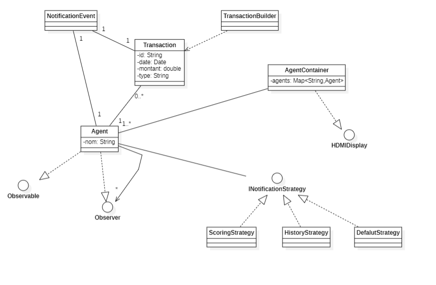
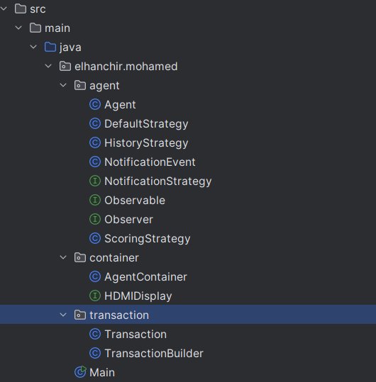
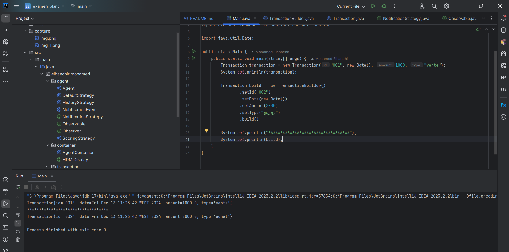
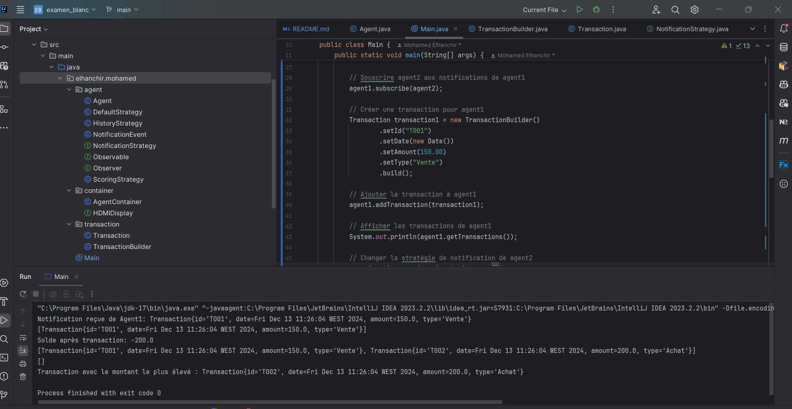
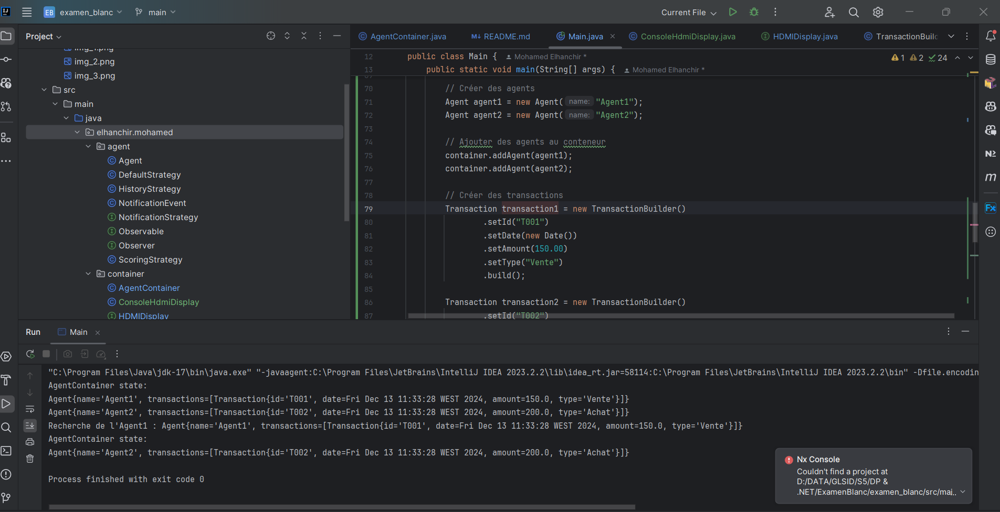

# ELHANCHIR MOHAMED - GLSID3
# Gestion des Conteneurs d'Agents

## Description
Ce projet met en œuvre une application permettant de gérer des conteneurs d'agents.
Chaque agent gère des transactions et peut notifier d'autres agents qui se sont abonnés à ses activités. 
L'application utilise divers **design patterns** pour assurer une architecture claire, modulaire et évolutive.


## Fonctionnalités principales

### 1. Transactions
- Les transactions sont définies par un **id**, une **date**, un **montant**, et un **type** (Vente ou Achat).
- Créées en utilisant le **pattern Builder**.

### 2. Abonnement des Agents
- Chaque agent peut s'abonner aux activités d'autres agents.
- Les notifications incluent :
    - Le nom de l'agent.
    - La transaction ajoutée.

### 3. Stratégies de Traitement
- Possibilité de définir plusieurs stratégies de traitement des notifications :
    - **ScoringStrategy** : Mise à jour du solde en fonction du montant de la transaction.
    - **HistoryStrategy** : Suivi de l'historique des transactions.
    - Stratégies extensibles pour répondre à d'autres besoins.

### 4. Conteneur d'Agents
- Gère une collection d'agents avec un **HashMap**.
- Fournit des opérations classiques :
    - Ajout d'un agent.
    - Suppression d'un agent.
    - Recherche d'un agent.
- Affichage délégué à des afficheurs via une interface HDMI. Les afficheurs VGA nécessitent un adaptateur.
- Implémentation du **Singleton Pattern** pour garantir une instance unique.

### 5. Aspects Techniques
- **Journalisation** :
    - Une annotation `@Log` mesure et journalise la durée d'exécution des méthodes.
- **Cache** :
    - Une annotation `@Cachable` pour optimiser la méthode retournant la transaction au montant le plus élevé.
- **Sécurité** :
    - Une annotation `@SecuredBy(roles={...})` gère l'accès en fonction des rôles utilisateurs.

## Structure du Projet
### 1. Diagramme UML



### 2. Architecture


### 3. Implémentation et Tests de la Classe Transaction
- **Transaction** : Classe principale représentant une transaction.

```java
package elhanchir.mohamed.transaction;

import java.util.Date;

public class Transaction {
    private String id;
    private Date date;
    private double amount;
    private String type;

    public Transaction(String id, Date date, double amount, String type) {
        this.id = id;
        this.date = date;
        this.amount = amount;
        this.type = type;
    }

    public String getId() {
        return id;
    }

    public void setId(String id) {
        this.id = id;
    }

    public Date getDate() {
        return date;
    }

    public void setDate(Date date) {
        this.date = date;
    }

    public double getAmount() {
        return amount;
    }

    public void setAmount(double amount) {
        this.amount = amount;
    }

    public String getType() {
        return type;
    }

    public void setType(String type) {
        this.type = type;
    }

    @Override
    public String toString() {
        return "Transaction{" +
                "id='" + id + '\'' +
                ", date=" + date +
                ", amount=" + amount +
                ", type='" + type + '\'' +
                '}';
    }
}
```


- **TransactionBuilder** : Classe Builder pour créer des transactions.
    
```java
package elhanchir.mohamed.transaction;

import java.util.Date;

public class TransactionBuilder {

        private String id;
        private Date date;
        private double amount;
        private String type;

        public TransactionBuilder setId(String id) {
            this.id = id;
            return this;
        }

        public TransactionBuilder setDate(Date date) {
            this.date = date;
            return this;
        }

        public TransactionBuilder setAmount(double amount) {
            this.amount = amount;
            return this;
        }

        public TransactionBuilder setType(String type) {
            this.type = type;
            return this;
        }

        public Transaction build() {
            return new Transaction(id, date, amount, type);
        }

}
   ```

- **TransactionTest** :


### 4. Implémentation et Tests de la Classe Agent
- **Agent** : Classe principale représentant un agent.

```java
package elhanchir.mohamed.agent;


import elhanchir.mohamed.transaction.Transaction;

import java.util.ArrayList;
import java.util.HashSet;
import java.util.List;
import java.util.Set;

public class Agent implements Observer, Observable {
    private String name;
    private List<Transaction> transactions;
    private Set<Observer> observers;
    private NotificationStrategy strategy;

    public Agent(String name) {
        this.name = name;
        this.transactions = new ArrayList<>();
        this.observers = new HashSet<>();
        this.strategy = new DefaultStrategy(); // Stratégie par défaut
    }

    public void addTransaction(Transaction transaction) {
        transactions.add(transaction);
        notifyObservers(new NotificationEvent(this.name, transaction));
    }

    @Override
    public void subscribe(Observer observer) {
        observers.add(observer);
    }

    @Override
    public void unsubscribe(Observer observer) {
        observers.remove(observer);
    }

    @Override
    public void notifyObservers(NotificationEvent event) {
        for (Observer observer : observers) {
            observer.update(event);
        }
    }

    @Override
    public void update(NotificationEvent event) {
        strategy.handleNotification(event);
    }

    public void setStrategy(NotificationStrategy strategy) {
        this.strategy = strategy;
    }

    public Transaction getTransactionWithLargestAmount() {
        return transactions.stream()
                .max((t1, t2) -> Double.compare(t1.getAmount(), t2.getAmount()))
                .orElse(null);
    }

    public String getName() {
        return name;
    }

    public List<Transaction> getTransactions() {
        return transactions;
    }

    @Override
    public String toString() {
        return "Agent{" +
                "name='" + name + '\'' +
                ", transactions=" + transactions +
                '}';
    }
}
```

- **AgentTest** :


### 5. Implémentation et Tests de la Classe AgentContainer
- **AgentContainer** : Classe principale représentant un conteneur d'agents.

```java
package elhanchir.mohamed.container;

import elhanchir.mohamed.agent.Agent;

import java.util.HashMap;
import java.util.Map;

public class AgentContainer {

    private static AgentContainer instance;
    private Map<String, Agent> agents;

    private AgentContainer() {
        agents = new HashMap<>();
    }

    public static AgentContainer getInstance() {
        if (instance == null) {
            instance = new AgentContainer();
        }
        return instance;
    }

    public void addAgent(Agent agent) {
        agents.put(agent.getName(), agent);
    }

    public void removeAgent(String name) {
        agents.remove(name);
    }

    public Agent getAgent(String name) {
        return agents.get(name);
    }

    public void display() {
        System.out.println("AgentContainer state: ");
        for (String name : agents.keySet()) {
            System.out.println(agents.get(name));
        }
    }

}
```
- **Interface HDMIDisplay** :
```java
package elhanchir.mohamed.container;

public interface HDMIDisplay {
    void display();
}
```

- **AgentContainerTest** :


### 6. Implémentation des Aspects Technique
- **LogAspect** : Aspect pour la journalisation.

```java
package elhanchir.mohamed.aspect;

import java.lang.annotation.ElementType;
import java.lang.annotation.Retention;
import java.lang.annotation.RetentionPolicy;
import java.lang.annotation.Target;

@Retention(RetentionPolicy.RUNTIME)
@Target(ElementType.METHOD)
public @interface Log {
}
```

- **Création l'aspect de journalisation** :

```java
package elhanchir.mohamed.aspect;

import org.aspectj.lang.ProceedingJoinPoint;
import org.aspectj.lang.annotation.Around;
import org.aspectj.lang.annotation.Aspect;
import org.aspectj.lang.annotation.Pointcut;

@Aspect
public class LoggingAspect {

    @Pointcut("@annotation(elhanchir.mohamed.aspect.Log)")
    public void logAnnotatedMethods() {
    }

    @Around("logAnnotatedMethods()")
    public Object logExecutionTime(ProceedingJoinPoint joinPoint) throws Throwable {
        long start = System.currentTimeMillis();
        Object proceed = joinPoint.proceed();
        long executionTime = System.currentTimeMillis() - start;
        System.out.println(joinPoint.getSignature() + " exécuté en " + executionTime + "ms");
        return proceed;
    }
}
```


- **CachableAspect** : Aspect pour le cache.

```java
package elhanchir.mohamed.aspect;

import java.lang.annotation.ElementType;
import java.lang.annotation.Retention;
import java.lang.annotation.RetentionPolicy;
import java.lang.annotation.Target;

@Retention(RetentionPolicy.RUNTIME)
@Target(ElementType.METHOD)
public @interface Cachable {
}
```

- **Création l'aspect de cache** :

```java
package elhanchir.mohamed.aspect;

import org.aspectj.lang.ProceedingJoinPoint;
import org.aspectj.lang.annotation.Around;
import org.aspectj.lang.annotation.Pointcut;

import java.util.HashMap;
import java.util.Map;

public class CachingAspect {
    private final Map<String, Object> cache = new HashMap<>();

    @Pointcut("@annotation(elhanchir.mohamed.aspect.Cachable)")
    public void cachableMethods() {
    }

    @Around("cachableMethods()")
    public Object cacheResult(ProceedingJoinPoint joinPoint) throws Throwable {
        String key = joinPoint.getSignature().toString();
        if (cache.containsKey(key)) {
            System.out.println("Returning cached result for " + key);
            return cache.get(key);
        }

        Object result = joinPoint.proceed();
        cache.put(key, result);
        return result;
    }
}
```
